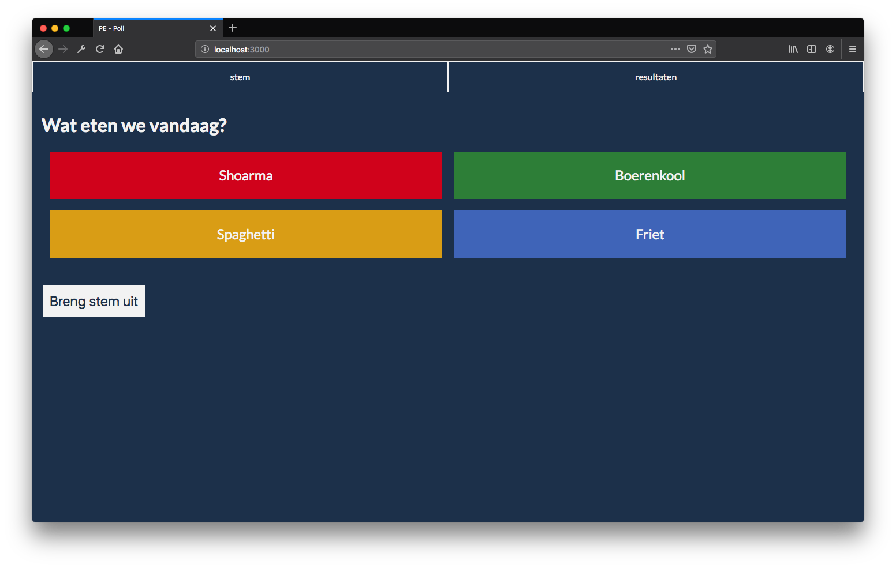

# live poll - PE

**Build a progressively enhancement prototype based on a user story.**




## Index
- [The assignment](#the-assignment)
- [Live poll](#live-poll)
    - [Progressive enhancement](#progressive-enhancement)
        - [functional and reliable](#functional-and-reliable)
        - [usable](#usable)
        - [pleasurable](#pleasurable)
    - [Sources](#Sources)
    - [breakdown sketches](#breakdown-sketches)

### The assignment

### Live Poll

The use case was about building a progressively enhanced live poll. In my case I wanted to let users give a answer to one of the most asked questions in the Dutch vocabulary. "Wat eten we vandaag" = "what will be having for dinner tonight". Users need to have a basic functionality to cast their vote using a submit form. After submitting their answers, users need to have the ability to see what the score is between the possible answers. 

#### Progressive enhancement

##### functional and reliable

First I created a server that was able to handle the post request of the voting form. After all, the voting form is a post request to the server. The server gets the post request and sends the inputted vote to the database. 


Progressive enhancement doesn't mean you can't do form validation. Just let the server check if there is vote casted. If the `req.body.vote ` is undefined, you throw a error message to your user. 

 

##### usable


In the usable state is where I added some styling to make the whole app look more appealing.  Kahoot was my inspiration so of course I wanted those colorful blocks;

First, I've checked if the main text and the background-color where in good contrast ratio: 


For the layout styling of the voting I've used Css grid. Not all browsers support grid so far. 

So I worked with some feature detection in Css.

```css
@supports (display: grid){
fieldset {
	display: grid;
	border: none;
	grid-template-columns: 1fr 1fr;
	grid-template-rows: 1fr 1fr;
	grid-gap: 20px;
  }
}

@supports not (display: grid) {
  fieldset {
		display: flex;
		flex-direction: column;
		justify-content: space-between;
  }
} 
```

If the client's browser can handle Css grid. It will use css grid. If it does not support css grid, the layout will be handled by flexbox. But, if the client also doesnt support flexbox, the default browser styling of the fieldset will come into place. Placing all of the blocks directly under each other. That is also a good fallback. 

Some more fallbacks in css I have implemented :

```
span {
    margin:0 1rem;
    margin: 0 16px;
    display: block;
    background: white;
    background: rgb(242,242,242);
    background: #F2F2F2;
}
```

When styling this span I have provided a fallback on the fontsize and the background color. Because of the inner workings of CSS, if the `em` value is supported by the browser, it will use the `px` value. 

The same goes for the color: 

- when a `#` color code is not supported it will use the `rgb`color. 
- if `rgb`is not supported, it will use a user agent color. 


For every css rule I looked up it's support percentage on [caniuse](caniuse.com) to determine if it needed a fallback. 

I choose to still display the table in which the vote scores are shown. I think it's important because of accessibility reasons. The graph chart isn't that 'screenreader-proof', but a table can always be read. 

##### fade -in animation on refresh button 

To discourage the user from hitting the refresh button every second, I gave the button a fade in animation. 
It goes from opacity: 0 to opacity: 1 in less than 5 seconds. The fadein is meant to suggest that the button or the page is still loading. 

##### Noscript tag

Yes, that's right. I've used a no script tag. But I have used it with a proper purpose. Not to laugh at the users without Javascript. When the user doesn't have Javascript enabled, the no script tag gets into action. It renders the following meta tag to the head of the body. 

` <meta http-equiv="refresh" content="5;URL='/results'" />`

What this meta tag does, it refreshes the page after 5 seconds to the path that is given as parameter. 

Some browsers do not support this, as a fallback for this I display a button. Using that button, users can refresh the page manually. 

On refresh of the page, the new vote results get rendered by the server. So this simulates the feeling of live data update.

Important to notice; the noscript gets rendered by the server on only one route. So the no script tag is not the default. 

##### Hover and focus styles


When a checkbox is selected, it gets a border radius and a solid white border. This is to give the user feedback about the option is chosen. The border radius is different then the four hard corners of the rest. 


##### pleasurable


For the pleasurable layer I wanted to live update the data without the need for the user, to refresh the page. The server and the client have to work together in this layer, so client JS is necessary. 

I'm using firestore as my db. Firestore has a handy ``onsnapShot` function. What this function does is watching the DB for changes in data. When a changes is made in the data (for example, another client casts a vote), the functions returns an object containing the new data. 

When the onsnapshot function fires I trigger the ``emit`` function on my server. This is where it gets really interesting: 

```
  let observer = db.collection('votes').doc('food').onSnapshot(res => {
  // console.log(res)
  let data = {
    shoarma: res._fieldsProto.shoarma,
    boerenkool: res._fieldsProto.boerenkool,
    spaghetti: res._fieldsProto.spaghetti,
    friet: res._fieldsProto.friet
  }
  
  app.emit('message', {
    title: 'New message!',
    data
  });
```


It is possible for Node to stream text data! That's so awesome. 

```
app.get('/eventstream', (req, res, next) => {
  res.set({
    'Content-Type': 'text/event-stream',
    'Cache-Control': 'no-cache',
    'Connection': 'keep-alive'
  });
  app.on('message', data => {
    res.write(`event: message\n`);
    res.write(`data: ${JSON.stringify(data)}\n\n`);
  });
});
```

The ```/eventstream`` is basically the route that enables me to stream text/data from the server to the client. For this to work the client has to listen to the evenstream route. On the client I create a `New Eventsource`. Of course for the sake of PE I first check if the client supports it. 

```
if (!!window.EventSource) {
    let refresh = document.getElementById("refresh")
    refresh.remove()
    const evtSource = new EventSource('/eventstream');
    evtSource.addEventListener('message', event => {
        const data = JSON.parse(event.data);

        let values = {
            shoarma: data.data.shoarma.integerValue,
            boerenkool: data.data.boerenkool.integerValue,
            spaghetti: data.data.spaghetti.integerValue,
            friet: data.data.friet.integerValue
        }
```

When the clients browser support the Eventsource api, the client js first will remove the "refresh button". Because the user doesn't need it anymore. When new data is added to the db the EventSource stream will trigger and collect the data. After the data is collected, I render it to the dom. All this together creates a live data update stream. The bar chart heights get updated and the numbers in the table too. 

A simple transition on the bars in the chart will make everything look smoothly. 

#### Sources

- [caniuse](https://caniuse.com/)
- [MDN](https://developer.mozilla.org/nl/)
- [html5please](https://html5please.com/)

- A [css tricks article](https://css-tricks.com/how-supports-works/) about the use of css at supports.
- Mdn feature [detection article](https://developer.mozilla.org/en-US/docs/Learn/Tools_and_testing/Cross_browser_testing/Feature_detection)

#### Breakdown sketches

The sketches are divided into three fases. 

phase 1 is the functional and reliable state, phase 2 is the usable and phase 3 is the pleasurable.


